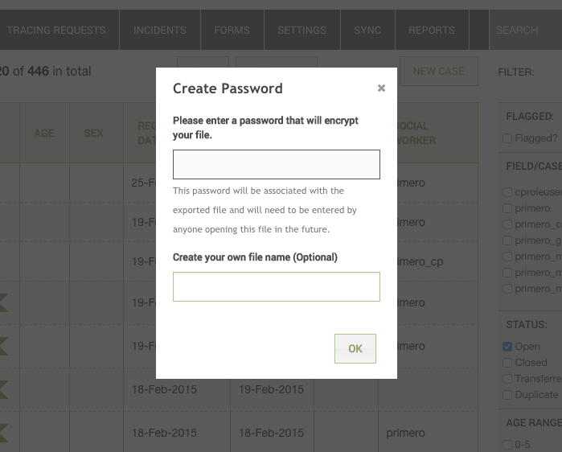
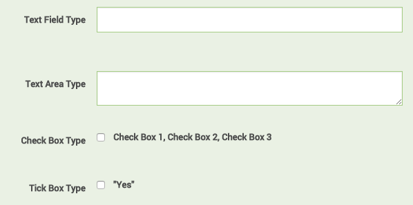
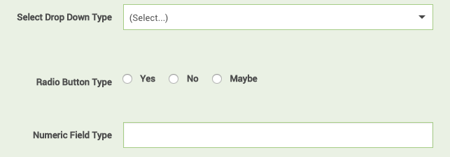
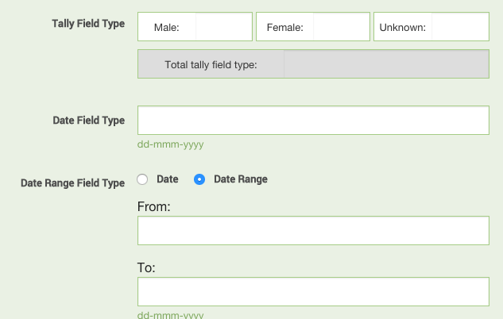

==========================

**Primero Glossary of Terms **

**Release 1.1.0**

March 2015

***Prepared for:***

==========================

3 United Nations Plaza

New York, NY 10017

 ***Prepared by:***

==========================

Quoin, Inc.

186 South Street, Suite 600

Boston, MA 02111

Primero Glossary of Terms
=========================

Local Installer
---------------

A local installer describes a deployment to a machine that can run without internet connection. This is laptop-based at this time, but future functionality may include mobile devices. 

Instance
--------

A single environment in which Primero has been distributed.

Deployment
----------

The act of applying a new version and associated configurations to all
instances of Primero in the same implementation area, combined with
training, area-specific role and user setup, data migrations, and
general support.

Components
----------

Application functionality is defined by Primero **Components**. The
current implemented Primero Components are:

-   **Cases**, which track an individual human

-   **Incidents**, which log point-in-time events that occur to individuals

-   **Tracing Requests**, which describe an attempt to trace, locate and reunify separated children.

Modules
-------

Many aspects of component functionality are configurable. This
configuration is performed through **Modules**. Modules represent how
the system will be used. Out of the box, Primero contains two Modules,
though only the first will be activated in Sierra Leone:

-   **Child Protection (CP)**: The module represents case management needed around child protection. This includes the use of the tracing request component to aid FTR.

-   **Gender Based Violence (GBV)**: Tracks incidents related to GBV. Out of the box, it uses the case management component to aid GBV service providers.

Modules will specify what components will be available, and specify what Forms will be associated to those Components.

Programs
--------

Modules belong to **Programs** which represent a set of features (CPIMS,
GBVIMS, etc.) for the application. An example of a program is child
protection work within certain zones of a particular refugee camp.
Application functionality cannot be configured within a program. The
program merely provides descriptive information about the application’s
mission.

Users
-----

Application **Users** represent people who interact with the system.
Users log in, view and modify the information contained in Primero. Some
examples of users are case workers, data clerks, or managers.

-   **Superuser** - site administrator, has access to all functionality and records

User Groups
-----------

**User Groups** represent teams of users working together. For example
we may have a team of social workers in a particular refugee camp
providing services to children. We may have another team responsible for
the child’s best interest determination. A **manager** of a user group
will have some level of access, as defined by the user’s role, to all of
the data managed by that group, but not to the data managed by a
different group.

Roles
-----

Users will have **Roles**, which define what particular users are
allowed to do: read records, modify records, run reports, configure the
system. Examples of roles are CP Case Worker, GBV Social Worker, CP
Manager, Deployment Manager (IT Resource).

Along with defining what actions the user is allowed to perform, roles
also limit what kind of information is visible about individual records
for a specific user. For example, a GBV Social Worker may be allowed to
view and edit personally identifiable information (such as name, age,
and sex) about a particular client, while a GBV Manager will only see a
reduced set of information about that same person (age and sex, but not
the name), and will not be allowed to edit any of it.

The general term for these limits to what the user can do and what a
user can see is **Authorization**.

Records
-------

A **Record** describes an individual piece of data. The three permitted
Record types are **Cases**, **Incidents**, and **Tracing Requests**.

Modals
------

A modal is a “floating window within the current window. This is used on
exports, imports, flagging, etc. (See Below)

Fields
------

A **Field** is an individual piece of information within a record.
Fields are things like name, age, date of birth. Sometimes one field can
be used to store several values like a list of protection concerns or
all the languages spoken. Fields come in a handful of types:

-   Text

-   Text Area

-   Check Boxes and Tick Box

    -   “Options” - this will allow you to select what options can be checked by your users.

-   Select Drop Down

    -   “Options” or “Lookups” - Using Options will allow you to create the drop down values. Using Lookups will allow you to use a predetermined set of data as part of the field similar to Location. You cannot select both Option and Lookups. When entering Option, each value should be on a separate line.

-   “Multi-select” - Allows a user to select more than one answer.

-   Radio Button - “Options” - allows you up to 3 short choices for the radio button values

-   Numeric Value

-   Date

-   Date Range

**Help Text** is an option within each field that will allow you to
provide some guiding language to give the user a frame of reference for
the proper answer - or how to come to a conclusion based on information
provided.

Forms
-----
-----

A **Form** groups a set of fields for a record. By configuring the
PRIMERO application, you can specify new fields on a form, reorder the
fields, or allow different forms to share the same field. For example,
the standard form and field set for a child protection case has a form
called “Protection Concerns” which has a multi-select field listing the
protection concerns. Further down the form list, there appears a form
called “Protection Concern Details” which contains the same list (for
reference) and an ability to elaborate on each protection concern with
an additional set of fields. This narrows the information in each form
and allows the form to be targeted to a particular purpose or a step in
the case management workflow.

Form Subform
------------

Within a form there are two additional form sections that can be created
and used for different purposes. The first, the **Subform,** is a
section of a form where a user can repeat form data for additional
instances where that case is needed to document nearly identical data
for various visits, services, follow ups, etc.

Form Separator
--------------

The second, a **Separator,** becomes a new section within the form. An
example is within a closure form, there is the "Address of the child
during the case closure”section. This is not a sub-form because you only
close a case once.

Form Groups
-----------

A **Form Group** is how Primero groups forms into similar information
(example: Registration). You set what form group each individual form
belongs to on creation or edit. This allows for the form navigation
panel to be organized in concise, navigable, groupings to keep the panel
shorter and easier to use. When multiple forms are added to a group, it
becomes expandable/ collapsible and should be grouped accordingly. For
example, Identity/Registration form group includes all forms specific to
the identity (Basic Identity, Protection Concerns) and registration
(Interview Details) of a case.

